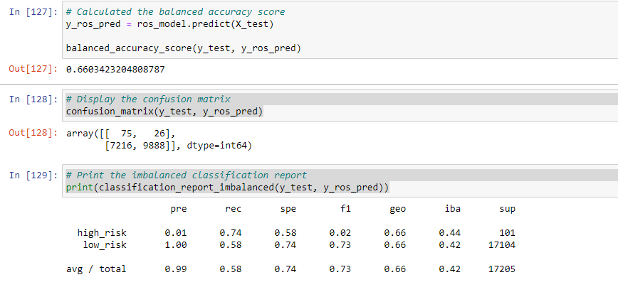
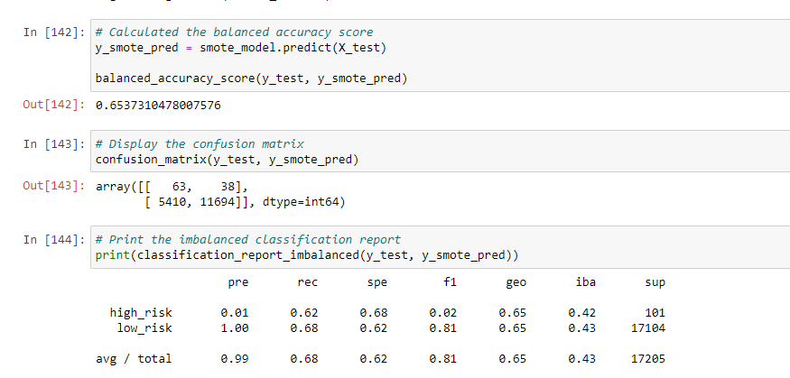
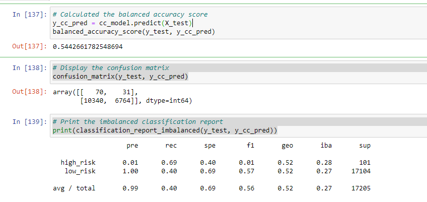
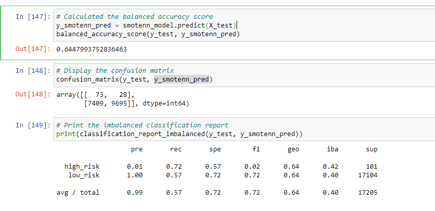
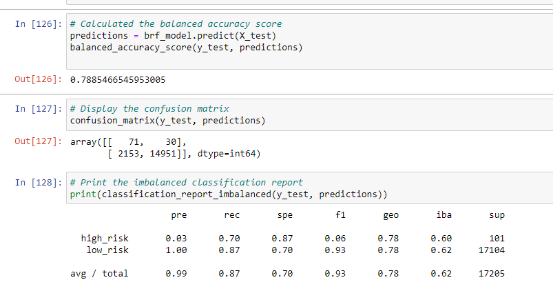
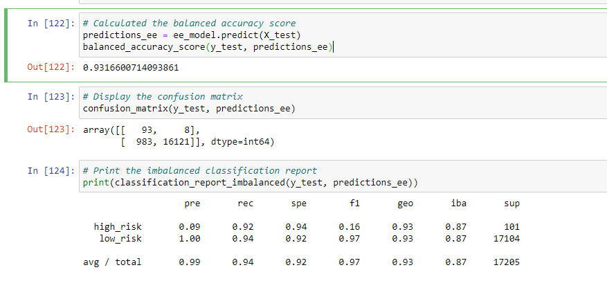

# Credit Risk Analysis

Create a model that can accurately predict credit risk for credit card applicat using 2019 credit card application data set. The prediction is to distinguish applicant with high credit risk from low credit risk.

## Project Overview:
Credit risk is an inherently unbalanced classification problem, as good loans easily outnumber risky loans. Therefore, objective is to employ different techniques to train and evaluate models with unbalanced classes.  
In this project, we are exploring 6 differet mdeols with different techniques to train and evaluate the models and then compare. These techniques are used to idnetify which ones is the best model or the approach to find a better one.

## Resources:

### Data:
- Data set and starter code can be download from the link [Credit risk analysis data and starter code](https://2u-data-curriculum-team.s3.amazonaws.com/dataviz-online/module_17/Module-17-Challenge-Resources.zip)
 
### Software:
1.  Anaconda [Install Anaconda](https://docs.anaconda.com/anaconda/install/)
2.  Python virtual enviornment with machine learning module (Windows instructions):
    -   Launch Anaconda prompt
    -   Update the global conda environment by typing `conda update conda` and press Enter
    -   After all the packages are collected, you'll see the prompt `Proceed ([y]/n)?`. Press the "Y" key (for "yes") and press Enter.
    -   In the command line, type `conda create -n mlenv python=3.7 anaconda`.
    -   After all the packages are collected, you'll see the prompt `Proceed ([y]/n)?`. Press the "Y" key (for "yes") and press Enter.
    -   Activate your mlenv environment by typing `conda activate mlenv` and press Enter, or open your Anaconda Prompt (mlenv).
    - Check depednacies using  `conda list | findstr numpy` on windows 
        Numpy, version 1.11 or later
        SciPy, version 0.17 or later
        Scikit-learn, version 0.21 or later
    -   Once all depnandices are chceked then activate the mlenv using `conda activate mlenv` and install imbalanced-learn Package using `conda install -c conda-forge imbalanced-learn` . After all the packages are collected, you'll see the prompt `Proceed ([y]/n)?`. Press the "Y" key (for "yes") and press Enter.
3.  Jupyter notebook . (Add machine learning virtual enviornment `mlenv` to jupyter notebook using  `python -m ipykernel install --user --name mlenv` or from Anaconda "Enviornment" menu)

## Solution overview: 

In this project, we are evaluating 6 different models using different techniquies to deal with the imbalance classes. As the target is labled and have discrete outcomes (high_risk vs low_risk), we will be using supervised machine learning classifation methodlogies.
In addition, as predicting credit risk is inharently deal with imblance data, we will compare following techinques.

### Following methods evaluated  for Class Imbalance:
#### Oversampling:
1.  **Random oversampling**: In random oversampling, instances of the minority class are randomly selected and added to the training set until the majority and minority classes are balanced
2.  **Synthetic Minority Oversampling Technique(SMOTE)**: In SMOTE, like random oversampling, the size of the minority is increased. In Random Oversampling, instances from minority class are randomly selected and added to the minority class. However in SMOTE,by contrast, new instacnes are interpolated. That is for an instance of a minotiry class, a number of its closest neighbors is choosen. Based on these neighbors, new values are created.

#### Undersampling
3. **Cluster Centroid Undersampling**:
Undersampling is another technique to address class imbalance. Undersampling takes the opposite approach of oversampling. Instead of increasing the number of the minority class, the size of the majority class is decreased.
In this analysis we are using **Cluster Centroid Undersampling**. Cluster centroid undersampling is akin to SMOTE. The algorithm identifies clusters of the majority class, then generates synthetic data points, called centroids, that are representative of the clusters. The majority class is then undersampled down to the size of the minority class.

#### Combined Over and undersampling:
4. **SMOTEENN**:
SMOTEENN combines the SMOTE and Edited Nearest Neighbors (ENN) algorithms. SMOTEENN is a two-step process:
    - Oversample the minority class with SMOTE.
    - Clean the resulting data with an undersampling strategy. If the two nearest neighbors of a data point belong to two different classes, that data point is dropped.

### Following methods evaluated for Ensemble learners:
The concept of ensemble learning is the process of combining multiple models, like decision tree algorithms, to help improve the accuracy and robustness, as well as decrease variance of the model, and therefore increase the overall performance of the model.
#### 5. Balanced Random Forest Classifier:
Instead of having a single, complex tree like the ones created by decision trees, a random forest algorithm will sample the data and build several smaller, simpler decision trees. Each tree is simpler because it is built from a random subset of features. A balanced random forest randomly under-samples each boostrap sample to balance it.  
#### 6. EasyEnsembleClassifier:
Bag of balanced boosted learners also known as EasyEnsemble.

This algorithm is known as EasyEnsemble. The classifier is an ensemble of AdaBoost learners trained on different balanced boostrap samples. The balancing is achieved by random under-sampling.

## Results:

### 1. Random Oversampling:

### 2. SMOTE:

### 3. Cluster Centroid Undersampling

### 4. SMOTEENN (Combined over and undersampling):

### 5. Ensamle - Balanced Random Forest Classifer:

### 6. Ensamle - Balanced Easy Ensemble Claissifer:

## Summary:
